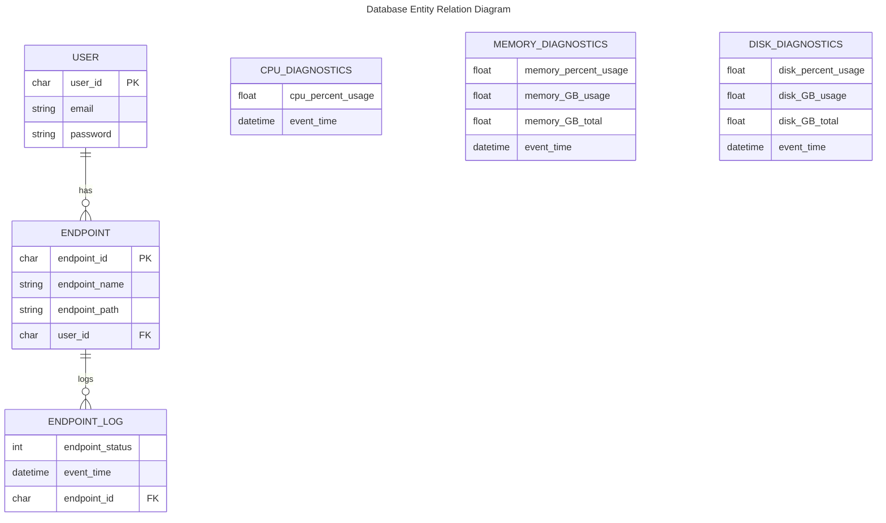
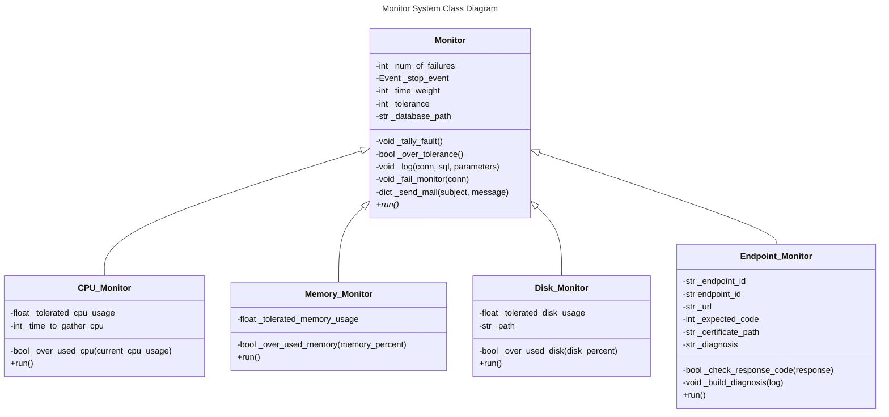

# General Application Web Server Monitoring System
General purpose Django Web Server Monitoring and Failure Notification Application.

Secure Software Engineering Final Project

## General Guide the Code

### /admin

/admin contains the settings, url pathing, and other things that allow us to make Django work correctly. Generally speaking, you should only be touching URLs regularly while to change the pathing for functions. Ask if you need help to change something on settings.py.

### /components

/components contains the components of the project - it will contain both the tooling to use components and the main components that make this program function. It also contains views, models, and test python files - generally speaking admin.py here will not be used and apps.py will practically never be used unless we need a name change for components.

### manage.py

manage.py provides a command line interface to interact with the django application

## Starting the application

Within a secure shell to your cloud web server run:

```bash
# Create virtual environment
python3 -m venv .venv

# Start virtual environment
source ./.venv/bin/activate

# Install all requirements needed to run the application
pip install -r requirements.txt

# create the database tables
python manage.py makemigrations
python manage.py migrate

# Change run script for 
sudo chmod u+x ./runme.sh

./runme.sh
```

Running this command will open a prompt to insert environment variables including:
- ADMIN_EMAIL
- EMAIL_HOST_USER
- EMAIL_HOST_PASSWORD
- COMPRESSION_PASSWORD

The AES_KEY used to encrypt your files will be generated and printed out to stdout. Make sure to save this key locally when you go to decrypt. 

For this instance of the server, you will never get the AES_KEY again.

You will need to 

## Diagrams:



